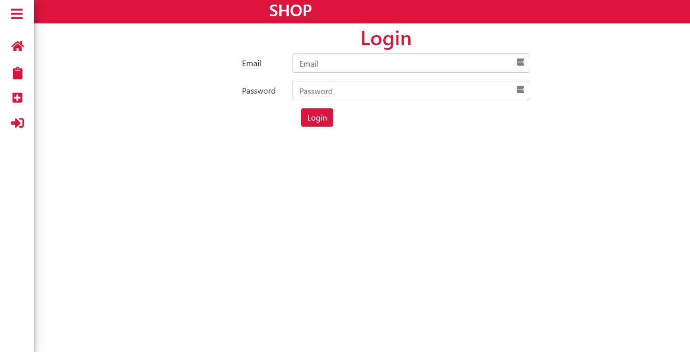

# Point-of-Sales APP


---


## Pendahuluan

Point-of-Sales APP (POS-APP) adalah Frondend dari RESTFul API Point-of-Sales yang bisa digunakan oleh kasir untuk checkout barang dan ada beberapa fitur lainnya sepertu berikut:
- Fungsi CRUD seperti menambah barang, melihat barang, edit informasi detail barang, dan menghapus barang. 
- Memilih barang untuk dimasukkan ke keranjang checkout. 
- Melihat barang yang terakhir di checkout
- Melihat penghasil harian, mingguan, bulanan dan tahunan
- Melihat grafik pendapatan harian, mingguan, bulanan dan tahunan


---


## Persyaratan Instalasi

- Node.js - Download dan Install [Node.js](https://nodejs.org/en/) - Librari untuk memudahkan pengembangan Aplikasi

- Nodemon - Download dan Install [Nodemon](https://nodemon.io/) - nodemon adalah tool untuk merestart secara automatis ketika ada file yang di edit.

---


## Instalasi

### Clone
```bash
$ git clone git@github.com:Muhammadsani/Poin-of-Sales.git
$ cd Poin-of-Sales
$ npm install
```
---

### Create Environment Variable
```bash
$ cp .env.example .env
$ nano .env
```
---
### Start Development
```bash
$ npm start
```
---

## Dependensi yang digunakan pada Development

- [axios](#)
- [bootstrap](#)
- [chart.js](#)
- [jquery](#)
- [local-storage](#)
- [mdbreact](#)
- [moment](#)
- [moment-timezone](#)
- [react](#)
- [react-chartjs-2](#)
- [react-dom](#)
- [react-icons](#)
- [react-moment](#)
- [react-redux](#)
- [react-router-dom](#)
- [react-scripts](#)
- [reactstrap](#)
- [redux](#)
- [redux-logger](#)
- [redux-promise-middleware](#)
- [rupiah-format](#)
- etc.

---
## Documentation
####Login

####List Product

####Add Product

####Review Pendapatan

####Grafik Penjualan

####Recent Order
